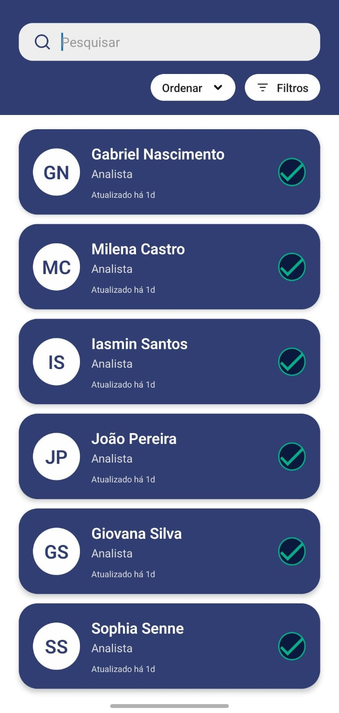

# Ponderada Semana 04 -  Tela de Listagem de Clientes
### Milena Castro e Gabriel Nascimento - Turma 13 - Engenharia de Software

## Descrição

Este projeto consiste em uma tela de **listagem de clientes** desenvolvida com React Native e Expo. A interface permite:

- Buscar clientes por nome.
- Filtrar a lista conforme diferentes critérios.
- Visualizar informações detalhadas de cada cliente de forma clara e intuitiva.

A proposta é oferecer uma experiência de usuário fluida e moderna, com foco em organização visual e performance.

## Como executar o projeto

1. Clone este repositório em sua máquina:

   ```bash
   git clone https://github.com/seu-usuario/seu-repositorio.git
   cd app-ux
   ```

2. Instale as dependências:

   ```bash
   npm install
   ```

3. Inicie o projeto com Expo:

   ```bash
   npx expo start
   ```

4. Escaneie o QR code com o app **Expo Go** no seu dispositivo móvel.


## Componentes desenvolvidos

Os componentes reutilizáveis estão organizados na pasta `components`:

- **ClienteItem.tsx**  
  Exibe os dados de cada cliente, como nome, profissão e status de conformidade ao perfil de investidor, com ícones representativos.

- **FilterButtons.tsx**  
  Fornece botões de filtro para refinar a visualização da lista com base em critérios pré-definidos.

- **SearchBar.tsx**  
  Barra de busca dinâmica que permite localizar clientes rapidamente por nome.

## Estrutura do Projeto

A estrutura principal do repositório é a seguinte:

```
app-ux
│
├── app                   # Configuração da navegação
│
├── assets                # Ícones e imagens utilizadas
│   ├── check_icon.svg
│   ├── filtro_icon.svg
│   ├── pesquisa_icon.svg
│   └── seta_icon.svg
│
├── components            # Componentes reutilizáveis
│   ├── ClienteItem.tsx
│   ├── FilterButtons.tsx
│   └── SearchBar.tsx
│
├── hooks                 # Hooks personalizados
│   ├── useColorScheme.ts
│   ├── useColorScheme.web.ts
│   └── useThemeColor.ts
│
├── screens               # Telas da aplicação
│   └── ListaClientesScreen.tsx
│
├── app.tsx               # Arquivo principal da aplicação
├── index.ts              # Ponto de entrada
├── app.json              # Configuração do Expo
├── package.json          # Dependências
├── tsconfig.json         # Configuração do TypeScript
└── README.md             # Este arquivo
```

---

## Visual da Tela

### Imagem da tela desenvolvida



### Vídeo demonstrativo

[Ver vídeo de demonstração](./ponderada_ux_video.mp4)

---

## Protótipo no Figma

Para visualizar o protótipo de design desenvolvido no Figma, acesse:

👉 [Link para o Figma](https://www.figma.com/design/PLUVmzBsk5QnjaimY5T4HP/Pond-ux-s04-mo6?node-id=0-1&m=dev)

---

## Tecnologias Utilizadas

- [React Native](https://reactnative.dev/)
- [Expo](https://expo.dev/)
- [TypeScript](https://www.typescriptlang.org/)
- [Figma (para prototipagem)](https://www.figma.com/)
- [SVG Icons](https://developer.mozilla.org/en-US/docs/Web/SVG)